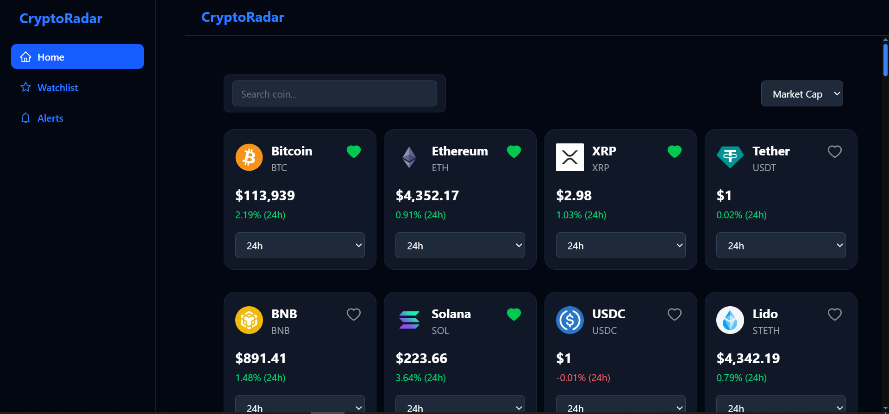
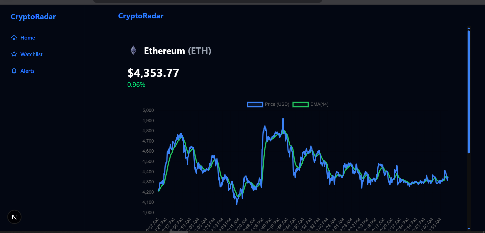
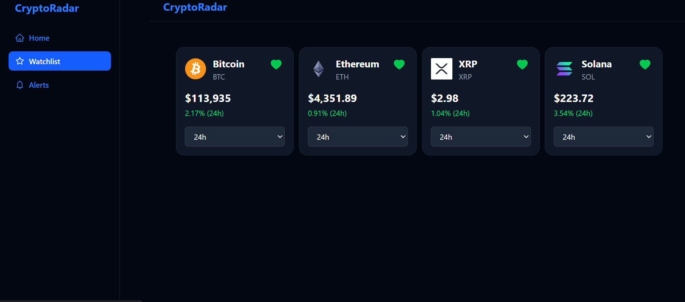
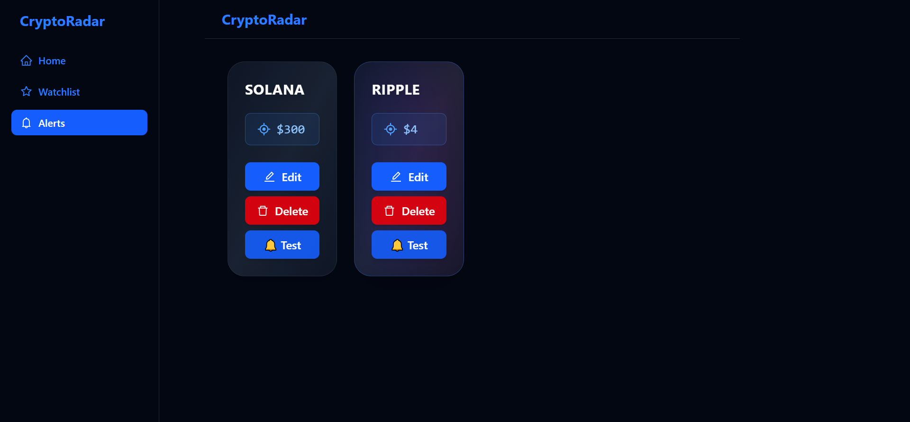

# 🚀 Crypto Radar  

🔎 **Crypto Radar** is a modern web application to track real-time cryptocurrency prices, explore charts, set alerts, and manage your personal watchlist — all in a sleek **Dark Mode only** UI.  

Built with the latest **Next.js 15 (App Router + Turbopack)**, **TailwindCSS v4**, and **TypeScript**, designed to be modular, fast, and developer-friendly.  

---

## ✨ Features

- 🔍 **Search & Filter**: Find any coin instantly.  
- 📊 **Interactive Charts**: Zoom & hover powered by `chart.js + react-chartjs-2`.  
- 📈 **Indicators**: Built-in RSI, EMA & Pivot (Traditional).  
- ⭐ **Watchlist**: Save your favorite coins (persisted in `localStorage`).  
- ⏰ **Smart Alerts**:  
  - Set custom target prices.  
  - Edit/Delete alerts anytime.  
  - Get **toast + sound + image notifications** when the target price is reached.  
- 🌓 **Dark Mode Only**: Eye-friendly, professional look — no toggle needed.  
- ⚡ **State Management**: Powered by `zustand` slices for watchlist, alerts, and theme.  
- 💾 **Local Storage Integration**: Data persistence across sessions.  
- 🎬 **Smooth Animations** with `Framer Motion`.  

---

## 🛠️ Tech Stack

| Category        | Tech                                                                 |
|-----------------|----------------------------------------------------------------------|
| **Framework**   | [Next.js 15](https://nextjs.org/) + App Router + Turbopack           |
| **Language**    | [TypeScript](https://www.typescriptlang.org/)                        |
| **Styling**     | [TailwindCSS v4](https://tailwindcss.com/)                           |
| **Charts**      | [chart.js](https://www.chartjs.org/) + [react-chartjs-2](https://react-chartjs-2.js.org/) |
| **State**       | [Zustand](https://zustand-demo.pmnd.rs/)                             |
| **Animations**  | [Framer Motion](https://www.framer.com/motion/)                      |
| **Data Fetch**  | [SWR](https://swr.vercel.app/)                                       |
| **Icons**       | [react-icons](https://react-icons.github.io/react-icons/)            |

---

## 🖼️ Screenshots

### 🏠 Home Page


### 📊 Coin Details


### ⭐ Watchlist


### ⏰ Alerts



---

## ⚡ Quick Start

### 1️⃣ Clone the repo
```bash
git clone https://github.com/yourusername/crypto-radar.git
cd crypto-radar
npm install
npm run dev
Your app will be live on: http://localhost:3000
 🚀

